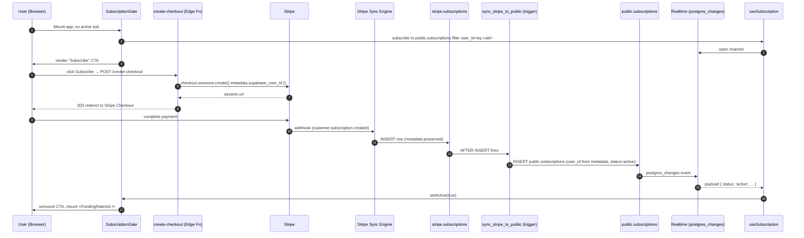

# Architecture & Trade-offs

## Goals

1. **Zero modifications** to `@vireson/funding-rate-arb`. The package's
   isolation constraint (project-agnostic, no host backend dependencies) is
   preserved by injecting all Supabase wiring through the public
   `persistenceStore` prop and the public `StateStore` interface.
2. **Multi-tenant** — one Supabase row per user, RLS-scoped to `auth.uid()`.
3. **Server-side liveness** — engine state advances even when the user closes
   their browser, via a `pg_cron`-triggered edge function.

## Two engines, one state

| Concern              | Client engine                       | Server engine (edge fn)              |
|----------------------|-------------------------------------|--------------------------------------|
| Source code          | `@vireson/funding-rate-arb`         | `edge-functions/fra-engine`          |
| Runtime              | Browser / WebView                   | Deno on Supabase Edge                |
| Triggers scans       | Yes (UI-driven)                     | Yes (pg_cron, every 60s)             |
| Places real orders   | Yes (when user has keys configured) | No (read/accrue only in v1)          |
| Reads/writes state   | via `SupabaseStateStore`            | direct service-role SQL              |
| Reads exchange keys  | from props                          | from Supabase Vault                  |

Both write to the same `fra_state.state` JSONB blob. The client treats the row
as authoritative on load (so server-accrued funding shows up immediately) and
the server treats existing positions as immutable (it only advances time-based
fields like `lastFundingAccrualAt`).

## Why JSONB blob + denormalized mirrors?

- **JSONB blob** keeps perfect parity with the in-memory `PersistedState`
  shape that `LocalStorageStore` already saves. The component's version-guard
  and migration logic continues to work unchanged.
- **Mirror tables** (`fra_positions`, `fra_pnl_history`, `fra_events`) enable
  SQL queries, indexed lookups, realtime subscriptions and analytics — none of
  which are practical against a single JSONB blob.

Mirror writes are best-effort: if they fail, the engine keeps running.

## Realtime pattern

The client subscribes to `postgres_changes` on `fra_state` filtered by its own
`user_id`. When the server-side tick fires, the client's `revision` counter
bumps, the `<FundingRateArb />` is remounted (`key={revision}`), and the
component re-runs `store.load()` to pick up the new state.

For higher-frequency UI updates (per-event push), the client can additionally
subscribe to `fra_events` — see the example app for a starting point.

## Security model

- **Client never sees other users' state** — RLS is mandatory on every table.
- **Exchange keys never reach the browser** in SaaS mode. The client passes
  empty `exchangeKeys` and runs in dry-run, while the server tick reads keys
  from Vault. (Wiring real-order execution server-side is a v2 enhancement.)
- **Cron endpoint** is gated by a long random `FRA_CRON_SECRET` shared between
  Postgres and the edge function. JWT verification is disabled because cron
  cannot present a user token.

## Limitations & v2 roadmap

| Limitation                                       | Planned fix                              |
|--------------------------------------------------|------------------------------------------|
| Server tick only accrues funding, no order exec  | Publish a headless engine entrypoint from the package and import it in the edge function |
| Single fallback funding rate (0.01% / 8h)        | Cache last-seen rates in `fra_state.state.lastRates` |
| No per-user cron frequency                       | Add a `tick_interval_secs` column and per-user schedule |
| No self-service rotation UI inside the SaaS app  | Ship `<VaultKeysAdmin />` page consuming the already-shipped `rotate-exchange-key` function (see §Vault rotation v2) |

## Subscription enforcement at tick time

`fra-engine` enforces Layer 7 of the tenant isolation model on every tick.
After fetching all `fra_state` rows where `is_running = true`, it intersects
them with the set of `user_id`s whose `public.subscriptions.status` is
`active` or `trialing`. The set is cached in a module-scoped variable for
`SUB_CACHE_TTL_MS` (45s by default — chosen as a balance between DB load and
cancellation latency, well inside the 30–60s window).

Behaviour:

- **Cache hit** (age < TTL): no DB call; tick uses the cached set.
- **Cache miss / cold start**: one `SELECT user_id FROM subscriptions WHERE status IN ('active','trialing')` query, then cache.
- **Query failure**: log + fail closed. Reuse the previous cache if any, else
  return an empty set. Canceled users never tick due to a transient outage.

The response payload now includes `{ tenants, skipped, cacheAgeMs,
cacheRefreshed, activeSubscribers }` for observability — `skipped` reveals
the count of running tenants without an active subscription on the most
recent cache snapshot.

---

## Billing event flow (Stripe → SubscriptionGate)

End-to-end sequence from a successful Stripe Checkout to the client's
`<SubscriptionGate />` unlocking — no page reload required.



**Latency budget**: typical Stripe webhook → Sync Engine → trigger → realtime
broadcast completes in **600–1500 ms**. The user sees the gate unlock without
refreshing the page.

**Failure modes**:
- *Webhook misses Sync Engine*: `stripe.subscriptions` never gets the row →
  trigger never fires. Mitigation: Sync Engine retries with exponential backoff.
- *Trigger raises*: missing `metadata.supabase_user_id` → trigger logs
  `RAISE WARNING` and returns NEW. Stripe row is preserved; ops can repair the
  metadata and re-fire by `UPDATE stripe.subscriptions SET ... WHERE id = ...`.
- *Realtime drop*: `useSubscription` falls back to polling `public.subscriptions`
  on tab focus and on a 30 s interval as a safety net.

---

## Vault rotation v2 — `<VaultKeysAdmin />`

Today, exchange API keys live in Supabase Vault under deterministic names
(`fra_hyperliquid_key_<user_id>`, `fra_okx_key_<user_id>`, etc.) and are
inserted/rotated by hand via SQL. v2 ships a self-service admin page in the
SaaS app so users rotate their own keys without ever leaking them client-side.

### Goals

1. Keys never round-trip through the browser in plaintext after submit.
2. Old keys are revoked atomically with new-key activation (no race where the
   server tick runs against a half-rotated pair).
3. Full audit trail: who rotated, when, from which IP, and which exchange.

### Surface

- **Route**: `/settings/keys` (lazy-loaded React page, gated by
  `<SubscriptionGate />`).
- **Component**: `<VaultKeysAdmin />` — one card per supported exchange
  (Hyperliquid, OKX, …) with status badge (`Configured` / `Missing` /
  `Rotating`), last-rotated timestamp, and **Rotate** / **Remove** actions.
- **Modal**: `<RotateKeyDialog exchange="hyperliquid">` — collects
  `apiKey` / `apiSecret` (or wallet privkey for HL), validates format
  client-side, then POSTs to the edge function.

### Wire protocol

```
POST /functions/v1/rotate-exchange-key
Authorization: Bearer <user JWT>
Content-Type: application/json

{
  "exchange": "hyperliquid" | "okx" | "...",
  "apiKey":   "...",
  "apiSecret":"...",
  "extra":    { "walletAddress": "0x..." }   // exchange-specific
}
```

### Edge function: `rotate-exchange-key`

```ts
// Pseudocode — full impl in supabase-saas/edge-functions/rotate-exchange-key/
const { data: { user } } = await supabase.auth.getUser(token);
if (!user) return 401;

const { exchange, apiKey, apiSecret, extra } = await req.json();
const vaultName = `fra_${exchange}_key_${user.id}`;
const payload   = JSON.stringify({ apiKey, apiSecret, ...extra });

// 1. Smoke-test the new credentials before storing.
const ok = await probeExchange(exchange, apiKey, apiSecret, extra);
if (!ok) return 400; // never write bad keys to Vault

// 2. Atomic rotate inside a single SQL statement.
await admin.rpc('rotate_vault_secret', {
  p_name:    vaultName,
  p_payload: payload,
  p_user_id: user.id,
});

// 3. Audit.
await admin.from('fra_key_rotations').insert({
  user_id: user.id, exchange, ip: req.headers.get('x-forwarded-for'),
});

return 200;
```

`rotate_vault_secret(p_name, p_payload, p_user_id)` is a SECURITY DEFINER
SQL function that wraps `vault.create_secret` / `vault.update_secret` in a
transaction so the row in `vault.secrets` is replaced atomically.

### RLS & audit

```sql
CREATE TABLE public.fra_key_rotations (
  id          uuid PRIMARY KEY DEFAULT gen_random_uuid(),
  user_id     uuid NOT NULL REFERENCES auth.users(id) ON DELETE CASCADE,
  exchange    text NOT NULL,
  ip          inet,
  created_at  timestamptz NOT NULL DEFAULT now()
);
ALTER TABLE public.fra_key_rotations ENABLE ROW LEVEL SECURITY;
CREATE POLICY "own rotations" ON public.fra_key_rotations
  FOR SELECT USING (auth.uid() = user_id);
```

Direct access to `vault.secrets` remains service-role only. The edge function
is the **only** path from a user JWT to a Vault write.

### Migration path

1. Ship `rotate_vault_secret` SQL function + `fra_key_rotations` table
   (`migrations/0003_vault_admin.sql`).
2. Deploy `rotate-exchange-key` edge function with `verify_jwt = true`.
3. Add `<VaultKeysAdmin />` and route. Existing users keep their hand-loaded
   secrets — the page just lets them rotate going forward.
4. Optional: a one-shot CLI script `bun run scripts/import-vault-keys.ts`
   that bulk-imports legacy keys from a CSV under service-role.
